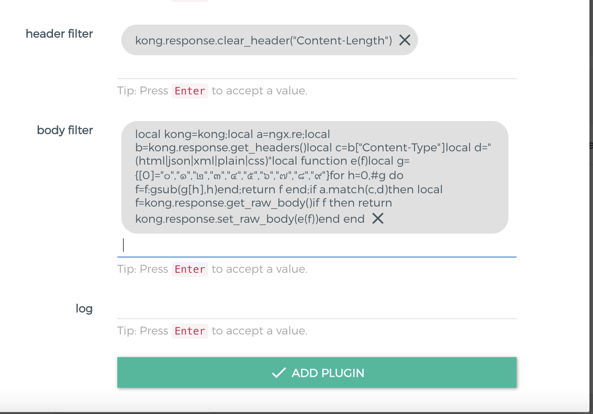
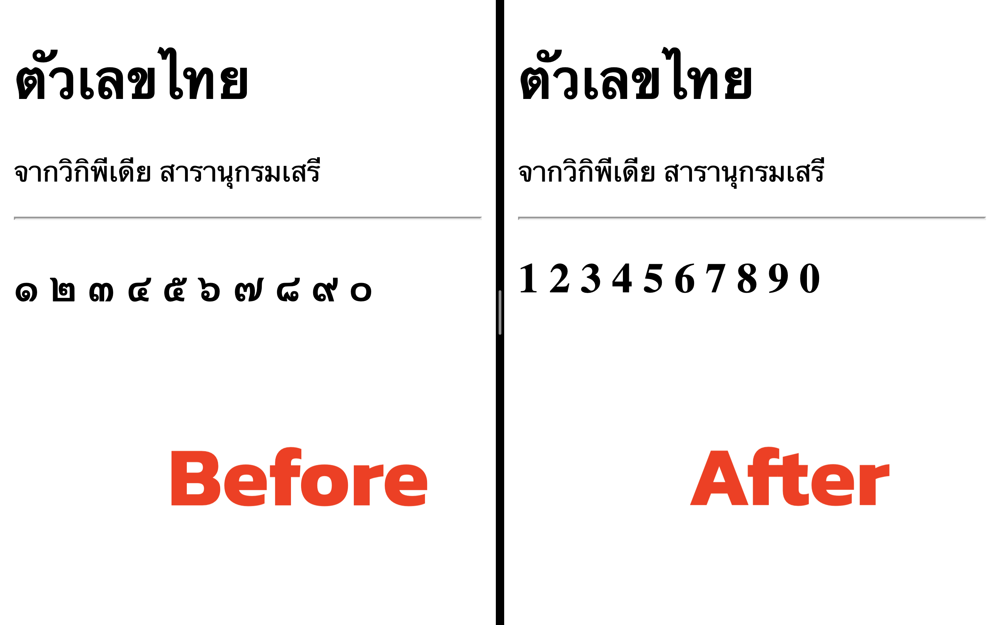

# Kong Replace Thai numeral

Kong serverless function for replace Thai numeral

| Number | Numeral |
|:------:|:-------:|
| 0 | ๐ |
| 1 | ๑ |
| 2 | ๒ |
| 3 | ๓ |
| 4 | ๔ | 
| 5 | ๕ |
| 6 | ๖ |
| 7 | ๗ |
| 8 | ๘ |
| 9 | ๙ |

## Add Kong Plugin

Add Kong Serverless post-function in

- `config.header_filter` with `kong.response.clear_header("Content-Length") `
- `config.body_filter` with [replace.lua](./replace.lua) code

> To minify your Lua code using a [minifier](https://mothereff.in/lua-minifier).

## Result

